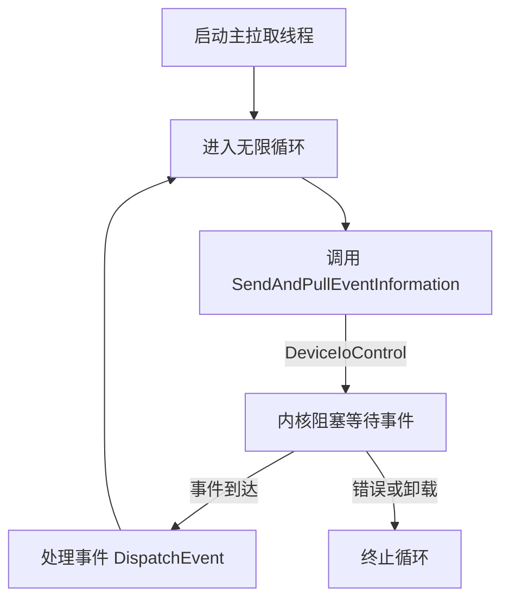

## **Dokan 事件处理流程分析**

#### **1. 事件拉取触发条件**

- **初始化阶段**：
  在 `DokanCreateFileSystem` 中，根据配置的线程数创建多个 `IOEvent`，并通过 `QueueIoEvent` 提交到线程池。每个 `IOEvent` 对应一个 **主拉取线程**。
- **线程池回调**：
  主拉取线程的回调函数 `DispatchDedicatedIoCallback` 包含一个 **无限循环** (`while (TRUE)`)，持续调用 `SendAndPullEventInformation` 拉取事件。

#### **2. 事件拉取逻辑**

- **内核阻塞等待：**

  `SendAndPullEventInformation`通过 `DeviceIoControl`调用 `FSCTL_EVENT_PROCESS_N_PULL`，在内核态等待事件到来。

  - **主拉取线程**：设置 `PullEventTimeoutMs=0`（无限等待），阻塞直到事件到达。
  - **非主线程**（未展示）：可能设置超时（如 `DOKAN_PULL_EVENT_TIMEOUT_MS`）。

- **事件处理**：
  若拉取到事件（`NumberOfBytesTransferred > 0`），调用 `DispatchEvent` 处理事件；否则继续循环。

#### **3. 是否“一直不停拉取”？**

- **主拉取线程**：
  **是**，通过无限循环 (`while (TRUE)`) **持续拉取事件**，但通过内核阻塞等待（`PullEventTimeoutMs=0`）避免 CPU 空转。

- **退出条件：**

  仅在以下情况下终止循环：

  1. **设备错误**：如 `DeviceIoControl` 返回错误（如设备断开）。
  2. **文件系统卸载**：通过 `DokanInstance->FileSystemStopped` 标志终止。
  3. **资源分配失败**：如内存不足导致无法继续处理。

------

### **流程图：主拉取线程事件处理**



---

### **关键代码段解析**

#### **1. 主拉取线程循环 (`DispatchDedicatedIoCallback`)**
```c
while (TRUE) {
    error = SendAndPullEventInformation(...);
    if (error) break;          // 错误退出
    if (NumberOfBytesTransferred == 0) continue; // 无事件继续等待
    DispatchEvent(...);        // 处理事件
}
```
- **无限循环**：持续拉取事件，无显式退出条件。
- **高效等待**：通过内核阻塞 (`PullEventTimeoutMs=0`) 避免 CPU 占用。

#### **2. 事件拉取函数 (`SendAndPullEventInformation`)**
```c
DeviceIoControl(
    FSCTL_EVENT_PROCESS_N_PULL,  // 控制码
    inputBuffer,                 // 发送处理结果（如有）
    &IoBatch->EventContext[0],   // 接收新事件
    BATCH_EVENT_CONTEXT_SIZE,
    &IoBatch->NumberOfBytesTransferred,
    NULL                         // 同步调用，阻塞等待
);
```
- **同步调用**：阻塞等待内核返回事件数据。
- **结果处理**：若拉取到事件，填充 `NumberOfBytesTransferred`。

---

### **性能与资源管理**
- **零空转设计**：
  主线程在内核态阻塞等待事件，无 CPU 占用。
- **批量处理优化**：
  `BATCH_EVENT_CONTEXT_SIZE` 允许一次拉取多个事件（取决于内核实现）。
- **错误恢复**：
  设备错误时调用 `HandleProcessIoFatalError` 清理资源并终止线程。

---

### **总结**
- **事件拉取是持续的**：主拉取线程通过无限循环和内核阻塞实现高效等待。
- **非轮询机制**：依赖内核通知机制（`FSCTL_EVENT_PROCESS_N_PULL`）避免资源浪费。
- **稳定性保障**：通过错误处理和卸载标志确保安全退出。