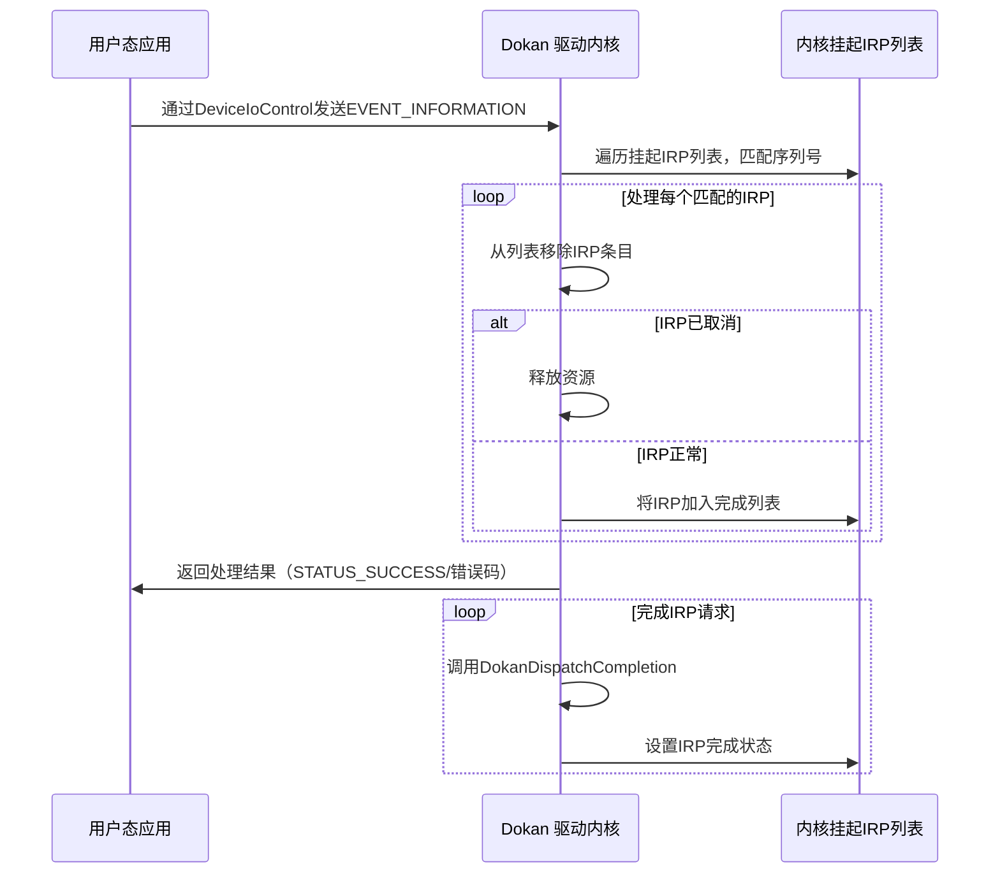
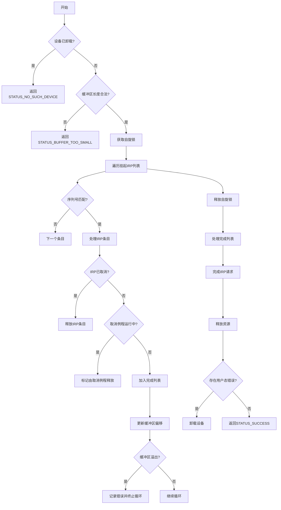

### **代码逻辑详解**

#### **1. 函数目标**
`DokanCompleteIrp` 函数负责 **将用户态文件系统应用处理完成的事件结果（`EVENT_INFORMATION`）与内核中挂起的 I/O 请求（IRP）关联**，并完成这些 IRP。这是 Dokan 驱动中 **用户态与内核态协作** 的核心环节。

---

### **关键步骤分析**

#### **1. 初始检查与参数验证**
```c
// 检查设备是否已卸载
if (IsUnmountPendingVcb(RequestContext->Vcb)) {
    return STATUS_NO_SUCH_DEVICE;
}

// 验证输入缓冲区长度
bufferLength = RequestContext->IrpSp->Parameters.DeviceIoControl.InputBufferLength;
if (bufferLength < sizeof(EVENT_INFORMATION)) {
    return STATUS_BUFFER_TOO_SMALL;
}

buffer = (PCHAR)RequestContext->Irp->AssociatedIrp.SystemBuffer;
```
- **目的**：
  确保设备仍处于挂载状态，且用户态传入的缓冲区足够大以容纳至少一个 `EVENT_INFORMATION` 结构。

#### **2. 遍历挂起的 IRP 列表**
```c
KeAcquireSpinLock(&RequestContext->Dcb->PendingIrp.ListLock, &oldIrql);
listHead = &RequestContext->Dcb->PendingIrp.ListHead;
for (thisEntry = listHead->Flink; thisEntry != listHead; thisEntry = nextEntry) {
    irpEntry = CONTAINING_RECORD(thisEntry, IRP_ENTRY, ListEntry);
    eventInfo = (PEVENT_INFORMATION)(buffer + offset);

    // 检查序列号是否小于0
    if (eventInfo->SerialNumber < lastSerialNumber) {
        result = ...; // 错误：序列号小于0
        break;
    }

    // 匹配序列号
    if (irpEntry->SerialNumber != eventInfo->SerialNumber) {
        continue;
    }

    // 处理 IRP 条目
    RemoveEntryList(thisEntry);
    if (irpEntry->RequestContext.Irp == NULL) {
        DokanFreeIrpEntry(irpEntry); // IRP 已取消，直接释放
    } else if (IoSetCancelRoutine(...) == NULL) {
        irpEntry->CancelRoutineFreeMemory = TRUE; // 取消例程正在运行
    } else {
        InsertTailList(&completeList, thisEntry); // 加入完成列表
    }

    // 更新偏移量并检查缓冲区溢出
    offset += GetEventInfoSize(...);
    if (offset > bufferLength) {
        result = ...; // 错误：缓冲区溢出
        break;
    }
}
KeReleaseSpinLock(...);
```
- **序列号（SerialNumber）**：
  每个 IRP 和 `EVENT_INFORMATION` 都有唯一序列号，用于 **匹配用户态结果与内核请求**。
- **同步机制**：
  使用自旋锁保护共享的挂起 IRP 列表，确保并发安全。
- **IRP 状态处理**：
  - **已取消的 IRP**：直接释放资源。
  - **正在取消的 IRP**：标记由取消例程释放。
  - **正常 IRP**：加入完成列表，后续处理。

#### **3. 完成 IRP 请求**
```c
while (!IsListEmpty(&completeList)) {
    listHead = RemoveHeadList(&completeList);
    irpEntry = CONTAINING_RECORD(listHead, IRP_ENTRY, ListEntry);

    if (offset >= bufferLength) {
        DokanCompleteIrpRequest(..., STATUS_CANCELLED); // 缓冲区耗尽，取消 IRP
    } else {
        eventInfo = (PEVENT_INFORMATION)(buffer + offset);
        DokanDispatchCompletion(...); // 分发完成结果
        offset += eventInfoSize;
    }

    DokanFreeIrpEntry(irpEntry); // 释放 IRP 条目
}
```
- **分发完成**：
  调用 `DokanDispatchCompletion` 将 `EVENT_INFORMATION` 结果写入 IRP，并设置完成状态。
- **资源释放**：
  无论成功或失败，最终释放 IRP 条目内存。

#### **4. 错误处理与设备卸载**
```c
if (badUsageByCaller) {
    DokanUnmount(RequestContext, RequestContext->Dcb); // 用户态错误，强制卸载设备
}
```
- **严重错误处理**：
  若用户态应用传入了非法数据（如乱序的序列号），触发设备卸载，防止系统挂起。

---

### **数据交互图**



---

### **流程图**



---

### **关键设计要点**

1. **序列号匹配机制**：
   通过唯一的 `SerialNumber` 确保用户态返回的结果与内核 IRP 一一对应，避免数据错乱。

2. **批量处理优化**：
   - 支持在一个缓冲区中传递多个 `EVENT_INFORMATION`（需启用 `AllowIpcBatching`）。
   - 通过 `offset` 递增遍历缓冲区，高效处理批量事件。

3. **取消安全性**：
   - 使用 `IoSetCancelRoutine` 确保 IRP 取消时资源正确释放。
   - 分离 `completeList` 避免在持有锁时操作 IRP。

4. **错误隔离与恢复**：
   - 检测到用户态错误（如乱序的序列号）时强制卸载设备，防止系统不稳定。
   - 缓冲区溢出检查防止内核内存越界访问。

---

### **典型场景示例**

1. **正常 IRP 完成**：
   - 用户态返回正确的 `EVENT_INFORMATION`，内核找到匹配的 IRP 并完成。

2. **IRP 已取消**：
   - 用户态处理期间 IRP 被取消，内核直接释放资源。

3. **批量处理**：
   - 用户态一次性返回多个事件结果，内核按序列号逐个处理。

4. **用户态错误**：
   - 传入的缓冲区长度不足或序列号乱序，触发设备卸载。

---

### **总结**
`DokanCompleteIrp` 是 Dokan 驱动中 **用户态与内核态协作的枢纽**，通过严格的序列号匹配、自旋锁同步和错误处理机制，确保 I/O 请求的高效完成与系统稳定性。其设计充分考虑了并发安全、资源泄漏防护和用户态错误的隔离，是文件系统驱动开发中的经典模式。