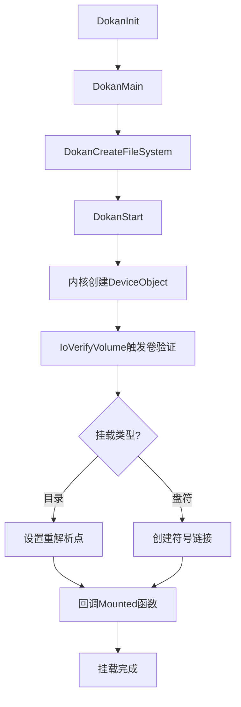
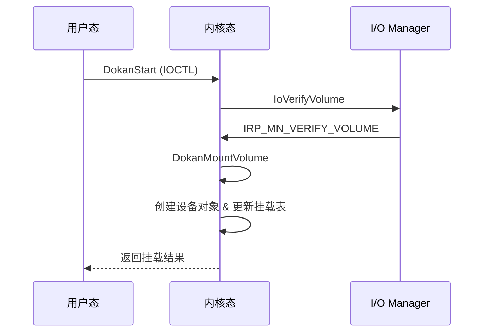

### **改进后的Dokan磁盘挂载流程分析文档**

---

### **1. 整体架构**  
Dokan的磁盘挂载流程分为用户态和内核态两部分，通过API与系统I/O管理器协同工作：  

| **组件**                | **职责**                                                     |
| ----------------------- | ------------------------------------------------------------ |
| **用户态（Dokan.dll）** | 提供API接口，实现文件系统回调函数（`DOKAN_OPERATIONS`）和配置参数（`DOKAN_OPTIONS`）。 |
| **内核态（Dokan.sys）** | 创建虚拟设备对象（DeviceObject），管理挂载点，处理I/O请求，与系统I/O管理器交互。 |

**用户态调用顺序**：  
```c
DokanInit();                        // 全局资源初始化（内存池、日志等）
status = DokanMain(&options, &ops); // 核心挂载逻辑入口（绑定配置与回调）
DokanShutdown();                    // 资源清理（释放设备对象、关闭句柄等）
```

---

### **2. 核心流程详解**  

#### **2.1 用户态流程（Dokan.dll）**  
1. **初始化文件系统实例**  
   - 调用 `DokanCreateFileSystem` 创建实例，绑定用户配置（`DOKAN_OPTIONS`）和回调函数（`DOKAN_OPERATIONS`）。  
   - 参数校验：检查挂载点格式（盘符或目录）、安全描述符、会话ID等。  

2. **驱动通信与设备创建**  
   - 调用 `DokanStart` 通过 `IOCTL` 与内核驱动通信，触发内核态 `DokanEventStart`。  
   - 内核驱动响应后，创建 `FILE_DEVICE_DISK` 类型的设备对象（DeviceObject），并将配置存储到设备控制块（DCB）。  

---

#### **2.2 内核态流程（Dokan.sys）**  

##### **关键步骤**  
1. **设备对象创建**  
   - 根据是否启用网络文件系统（`isNetworkFileSystem`），调用 `IoCreateDeviceSecure` 或 `IoCreateDevice` 创建设备对象。  
   - **安全机制**：通过 `SDDL` 字符串设置设备对象的默认权限（例如：允许管理员完全控制）。  

2. **卷验证与挂载触发**  
   - 调用 `IoVerifyVolume(dcb->DeviceObject, FALSE)` 触发卷合法性检查。  **!!!关键!!!**
   
     ```mermaid
     sequenceDiagram
         participant FS as File System Driver
         participant IOM as I/O Manager
         participant Disk as Disk Driver
         participant MM as Mount Manager
     %% Device Creation
     Note over FS,Disk: IoCreateDeviceSecure creates disk device object
     
     %% Step 1: Volume Verification via IoVerifyVolume
     FS->>IOM: IoVerifyVolume(diskDeviceObject, FALSE)
     IOM->>Disk: Create IRP with IOCTL_DISK_CHECK_VERIFY
     Disk->>Disk: Process IOCTL_DISK_CHECK_VERIFY\n(Check media state)
     Disk-->>IOM: Complete IRP (e.g., STATUS_SUCCESS)
     IOM-->>FS: Return verification result
     
     %% Intermediate: Additional Disk Queries
     Note over FS,Disk: File system queries disk parameters:
     FS->>Disk: IOCTL_DISK_GET_DRIVE_GEOMETRY\n(Get disk geometry)
     Disk-->>FS: Return drive geometry
     FS->>Disk: IOCTL_DISK_GET_LENGTH_INFO\n(Get disk length)
     Disk-->>FS: Return length info
     FS->>Disk: IOCTL_DISK_GET_PARTITION_INFO[_EX]\n(Get partition info)
     Disk-->>FS: Return partition info
     FS->>Disk: IOCTL_STORAGE_QUERY_PROPERTY\n(Query storage properties)
     Disk-->>FS: Return storage properties
     
     %% Step 2: Mounting the Volume
     MM->>FS: Issue IRP_MN_MOUNT_VOLUME (Mount request)
     FS->>FS: Initiate mount process:\n- Open disk\n- Read boot sector\n- Validate file system metadata
     FS->>FS: Create volume device object & attach to FS stack
     FS-->>MM: Complete IRP_MN_MOUNT_VOLUME (mount success)
     ```
   
     
   
   - 此操作会进一步调用 `DokanMountVolume`，进入挂载流程，创建卷设备对象。  
   
     ```mermaid
     graph TD
         A[IoVerifyVolume] --> B[调用DokanMountVolume]
         B --> C[调用DokanCreateMountPoint]
         C --> D[发送IOCTL_MOUNTDEV_LINK_CREATED命令]
         D --> E[更新挂载项属性]
         E --> F{是驱动器号挂载?}
         F -->|是| G[复制\\DosDevices\\X:格式的驱动器号]
         F -->|否| H[目录挂载点不处理驱动器号]
         G --> I[返回挂载信息]
         H --> I
         I --> J((结束))
         
     
     style A fill:#c0ffc0,stroke:#333
     style B fill:#f0f0f0,stroke:#333
     style C fill:#f0f0f0,stroke:#333
     style D fill:#f0f0f0,stroke:#333
     style E fill:#f0f0f0,stroke:#333
     style F fill:#ffeb3b,stroke:#333
     style G fill:#f0f0f0,stroke:#333
     style H fill:#f0f0f0,stroke:#333
     style I fill:#ffcccc,stroke:#333
     ```
   
     
   
3. **挂载点创建**  
   - **目录挂载点**：  
     - 若启用 `MountManager`，通过 `FSCTL_SET_REPARSE_POINT` 设置重解析点。  
     - 若禁用 `MountManager`，用户态直接调用 `DeviceIoControl` 设置重解析点。  
   - **盘符挂载点**：  
     - 调用 `IoCreateSymbolicLink` 创建符号链接（例如：`\DosDevices\G:` → `\Device\DokanDisk`）。  

4. **挂载完成通知**  
   
   - 内核驱动更新挂载列表（`InsertMountEntry`），并回调用户态的 `Mounted` 函数，通知挂载成功。  

---

### **3. 关键代码解析**  

#### **3.1 DokanCreateDiskDevice（内核态）**  
```c
NTSTATUS DokanCreateDiskDevice(...) {
    if (!isNetworkFileSystem) {
        // 创建本地磁盘设备（启用安全描述符）
        status = IoCreateDeviceSecure(..., &sddl, ..., &diskDeviceObject);
    } else {
        // 创建网络文件系统设备（无显式设备名）
        status = IoCreateDevice(..., &diskDeviceObject);
    }
    // 将配置参数保存到设备扩展（DCB）
    dcb = (PDokanDCB)diskDeviceObject->DeviceExtension;
    dcb->MountPoint = MountPoint;
    dcb->UseMountManager = UseMountManager;
    ...
}
```

#### **3.2 DokanMountVolume（内核态）**  
```c
NTSTATUS DokanMountVolume(...) {
    // 创建卷设备对象（VolumeDeviceObject）
    status = IoCreateDevice(..., &volDeviceObject);
    
    if (dcb->UseMountManager) {
        // 禁用AutoMount以避免驱动器号冲突
        DokanSendAutoMount(FALSE);
        // 通知MountManager新卷到达
        // 发送IOCTL_MOUNTDEV_*系列命令，获取设备唯一ID并创建持久化符号链接
        status = DokanSendVolumeArrivalNotification(dcb->DiskDeviceName);
        // 恢复AutoMount状态
        DokanSendAutoMount(TRUE);
    } else if (isDriveLetter) {
        // 直接创建符号链接
        DokanCreateMountPoint(dcb);
    }
    ...
}
```

---

### **4. 挂载类型对比**  

| **特性**             | **目录挂载点**                     | **盘符挂载点**               |
| -------------------- | ---------------------------------- | ---------------------------- |
| **实现方式**         | 重解析点（Reparse Point）          | 符号链接（Symbolic Link）    |
| **MountManager依赖** | 可选（启用时由内核管理）           | 必需                         |
| **典型场景**         | 虚拟文件系统挂载到目录（如云存储） | 模拟物理磁盘（分配驱动器号） |

---

### **5. 错误处理与调试**  

1. **常见错误码**  
   - `STATUS_ACCESS_DENIED`：权限不足（如未以管理员身份运行）。  
   - `STATUS_OBJECT_NAME_NOT_FOUND`：挂载目录不存在。  
   - `STATUS_DEVICE_BUSY`：设备已被其他进程占用。  

2. **调试建议**  
   - 启用Dokan日志（`DokanLogInfo` & `DokanLogError`）。  
   - 使用WinDbg捕获内核态IRP流程，重点关注 `IoVerifyVolume` 和 `FSCTL_SET_REPARSE_POINT`。  

---

### **6. 流程图总结**  

#### **挂载核心流程**  


#### **IoVerifyVolume触发流程**  


---

### **7. 优化与补充说明**  

1. **术语澄清**  
   - **DCB（Device Control Block）**：存储设备配置（挂载点、安全描述符等）。  
   - **VCB（Volume Control Block）**：存储卷元数据（文件系统类型、分区信息等）。  

2. **未覆盖的细节**  
   - **会话隔离**：通过 `SessionId` 实现多用户环境下的挂载点隔离。  
   - **异步I/O处理**：Dokan通过 `REQUEST_CONTEXT` 结构管理异步请求的上下文。  

3. **性能优化建议**  
   - 避免频繁调用 `IoVerifyVolume`，可通过缓存卷状态减少开销。  
   - 使用 `MountManager` 时，合理设置 `AutoMount` 状态以防止冲突。  

---

