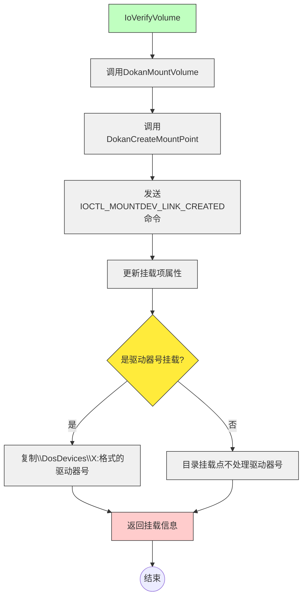
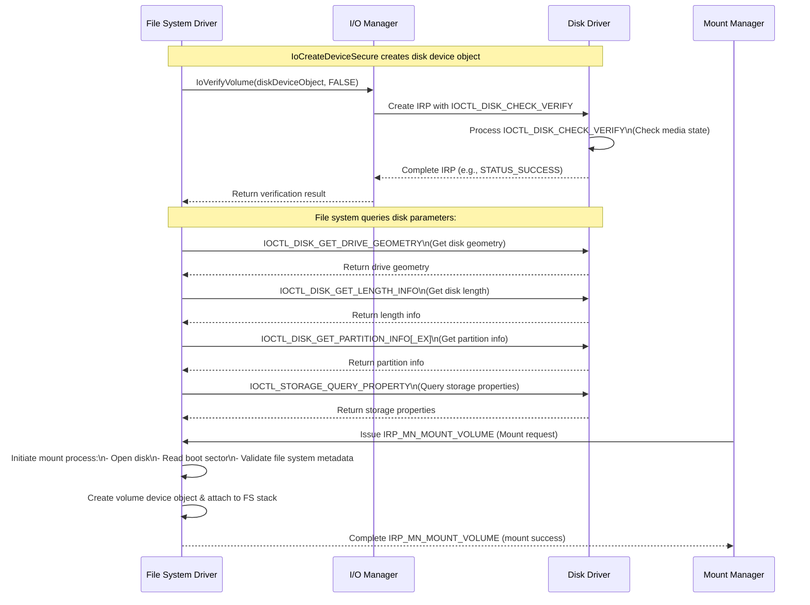
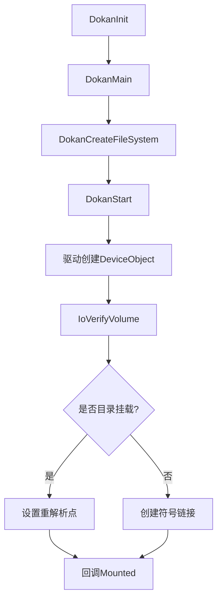

# Dokan磁盘设备挂载流程分析

### **1. 整体架构**

Dokan的磁盘挂载流程分为用户态和内核态两部分：

- **用户态组件（Dokan Library）**：提供API接口，供用户文件系统实现回调函数（`DOKAN_OPERATIONS`）和配置参数（`DOKAN_OPTIONS`）。
- **内核态驱动（Dokan.sys）**：负责与系统I/O管理器交互，创建虚拟设备并管理挂载点。

用户态调用顺序如下：

```c
DokanInit();                        // 初始化全局资源
status = DokanMain(&options, &ops); // 核心挂载逻辑入口
DokanShutdown();                    // 清理资源
```

---

### **2. DokanMain流程详解(dokan.dll)**

##### **2.1 核心步骤**

1. **初始化**：通过`DokanCreateFileSystem`创建文件系统实例，绑定用户配置（`DOKAN_OPTIONS`）和回调函数。
2. **驱动通信**：dll调用`DokanStart`，通过IOCTL与内核驱动交互，触发内核`DokanEventStart`。
3. **设备创建**：
   - 驱动创建`FILE_DEVICE_DISK`类型的设备对象（DeviceObject），保存配置到设备控制块（DCB）。
   - 调用`IoVerifyVolume`验证卷合法性，触发后续挂载流程。


DokanMain(dll)只是一个总入口函数，实际创建磁盘在DokanCreateFileSystem(dll)函数。经过一系列初始化赋值等操作后调用DokanStart函数，与驱动进行通信。驱动中函数`DokanEventStart(sys)`会进行响应处理，根据`DOKAN_OPTIONS`的配置由函数`DokanCreateDiskDevice(sys)`创建`FILE_DEVICE_DISK`类型的设备，并保存`DOKAN_OPTIONS`信息在设备DCB中，并通过`InsertMountEntry(sys)`插入到挂载列表中，接着调用`IoVerifyVolume(dcb->DeviceObject, FALSE);(sys)`验证卷的合法性（关键）。`IoVerifyVolume`会触发调用`DokanMountVolume(sys)`，`DokanMountVolume`会调用`DokanCreateMountPoint(sys)`，`DokanCreateMountPoint`会重新进入发出IOCTLCODE=`IOCTL_MOUNTDEV_LINK_CREATED`命令，并更新挂载项(use mount manager)。

DokaneventStart部分代码：

```c
DokanEventStart(__in PREQUEST_CONTEXT RequestContext)
{
...
    status = DokanCreateDiskDevice(
        RequestContext->DeviceObject->DriverObject,
        RequestContext->DokanGlobal->MountId, eventStart->MountPoint,
        eventStart->UNCName, volumeSecurityDescriptor, sessionId, baseGuidString,
        RequestContext->DokanGlobal, deviceType, deviceCharacteristics,
        mountGlobally, useMountManager, &dokanControl);
...
        // 验证卷（Volume）的合法性 
    IoVerifyVolume(dcb->DeviceObject, FALSE);

...

    if (useMountManager)
    {
        // 挂载项现在有了实际的挂载点，因为IoVerifyVolume会重新进入调用DokanMountVolume，
        // 后者会调用DokanCreateMountPoint，DokanCreateMountPoint会重新进入发出IOCTL_MOUNTDEV_LINK_CREATED命令，并更新挂载项。
        // 我们现在将实际的驱动器号复制到返回的信息中。我们希望它的形式是\DosDevices\G：。如果它是一个目录挂载点，则库不会使用此值。
        // 
        // The mount entry now has the actual mount point, because IoVerifyVolume
        // re-entrantly invokes DokanMountVolume, which calls DokanCreateMountPoint,
        // which re-entrantly issues IOCTL_MOUNTDEV_LINK_CREATED, and that updates
        // the mount entry. We now copy the actual drive letter to the returned
        // info. We expect it to be in the form \DosDevices\G:. If it's a directory
        // mount point, this value is unused by the library.
        if (isMountPointDriveLetter)
        {
            if (!dcb->MountPointDetermined)
            {
                // Getting into this block is considered very rare, and we are not
                // even sure how to achieve it naturally. It can be triggered
                // artificially by adding an applicable deleted volume record under
                // HKLM\System\MountedDevices.
                // 进入这个块是非常罕见的，我们甚至不确定如何自然地实现它。它可以通过在HKLM\System\MountedDevices下添加一个适用的删除卷记录来人为触发。
                DokanLogError(&logger, 0,
                    L"Warning: mount point creation is being forced.");
                driverInfo->Flags |= DOKAN_DRIVER_INFO_MOUNT_FORCED;
                DokanCreateMountPoint(dcb);

                if (!dcb->MountPointDetermined)
                {
                    // This is not believed to be possible. We have historical evidence
                    // that DokanCreateMountPoint always works, but we don't have proof
                    // that it always updates MountPointDetermined synchronously, so we
                    // still report success in this case.
                    DokanLogError(&logger, 0,
                        L"Mount point was still not assigned after forcing.");
                    driverInfo->Status = DOKAN_START_FAILED;
                    driverInfo->Flags |= DOKAN_DRIVER_INFO_NO_MOUNT_POINT_ASSIGNED;
                }
            }

            if (RtlCompareMemory(mountEntry->MountControl.MountPoint,
                L"\\DosDevices\\", 24) == 24)
            {
                driverInfo->ActualDriveLetter = mountEntry->MountControl.MountPoint[12];
                DokanLogInfo(&logger, L"Returning actual mount point %c",
                    driverInfo->ActualDriveLetter);
            }
            else
            {
                DokanLogInfo(
                    &logger,
                    L"Warning: actual mount point %s does not have expected prefix.",
                    mountEntry->MountControl.MountPoint);
            }
        }
        else if (!isMountPointDriveLetter && dcb->PersistentSymbolicLinkName)
        {
            // Set our existing directory path as reparse point.
            // It needs to be done outside IoVerifyVolume/DokanMountVolume as the
            // MountManager will also call IoVerifyVolume on the device which will
            // lead on a deadlock while trying to acquire the MountManager database.
            ULONG setReparseInputlength = 0;
            PCHAR setReparseInput = CreateSetReparsePointRequest(
                RequestContext, dcb->PersistentSymbolicLinkName,
                &setReparseInputlength);
            if (setReparseInput)
            {
                // 创建重解析点-->挂载点
                // 数据扩展：存储自定义数据（如符号链接目标路径、文件迁移信息等），供文件系统过滤器驱动程序解析
                // 行为重定向：触发特定的文件系统过滤器对 I/O 操作进行干预，例如将文件访问重定向到其他存储位置（如远程服务器或压缩文件）
                // 支持高级功能：实现符号链接（Symbolic Links）、挂载点（Mount Points）、数据加密、分层存储等
                status = SendDirectoryFsctl(RequestContext, dcb->MountPoint,
                    FSCTL_SET_REPARSE_POINT, setReparseInput,
                    setReparseInputlength);
                ExFreePool(setReparseInput);
                if (NT_SUCCESS(status))
                {
                    // Inform MountManager of the new mount point.
                    NotifyDirectoryMountPointCreated(dcb);
                }
                else
                {
                    DokanLogError(&logger, status,
                        L"Failed to set reparse point on MountPoint \"%wZ\"",
                        dcb->MountPoint);
                    driverInfo->Status = DOKAN_START_FAILED;
                    driverInfo->Flags |= DOKAN_DRIVER_INFO_NO_MOUNT_POINT_ASSIGNED |
                        DOKAN_DRIVER_INFO_SET_REPARSE_POINT_FAILED;
                }
            }
        }
    }

...
```


DokanCreateDiskDevice函数部分代码:

```c
NTSTATUS
DokanCreateDiskDevice(__in PDRIVER_OBJECT DriverObject, __in ULONG MountId,
    __in PWCHAR MountPoint, __in PWCHAR UNCName,
    __in_opt PSECURITY_DESCRIPTOR VolumeSecurityDescriptor,
    __in ULONG SessionId, __in PWCHAR BaseGuid,
    __in PDOKAN_GLOBAL DokanGlobal,
    __in DEVICE_TYPE DeviceType,
    __in ULONG DeviceCharacteristics,
    __in BOOLEAN MountGlobally, __in BOOLEAN UseMountManager,
    __out PDOKAN_CONTROL DokanControl)
{
...
 if (!isNetworkFileSystem)
        {
            status =
                IoCreateDeviceSecure(DriverObject,          // DriverObject
                    sizeof(DokanDCB),      // DeviceExtensionSize
                    &diskDeviceName,       // DeviceName
                    FILE_DEVICE_DISK,      // DeviceType
                    DeviceCharacteristics, // DeviceCharacteristics
                    FALSE,                 // Not Exclusive
                    &sddl,                 // Default SDDL String
                    NULL,                  // Device Class GUID
                    &diskDeviceObject);    // DeviceObject
        }
        else
        {
            status = IoCreateDevice(DriverObject,          // DriverObject
                sizeof(DokanDCB),      // DeviceExtensionSize
                NULL,                  // DeviceName
                FILE_DEVICE_DISK,      // DeviceType
                DeviceCharacteristics, // DeviceCharacteristics
                FALSE,                 // Not Exclusive
                &diskDeviceObject);    // DeviceObject
        }
...
}
```

`IoVerifyVolume`触发后dokan驱动响应流程图：



`IoVerifyVolume`触发后的系统响应流程图：




### DokanMountVolume(sys)

DokanMountVolume(sys)中创建volumeDevice，

```c
NTSTATUS DokanMountVolume(__in PREQUEST_CONTEXT RequestContext)
{
    ...
    if (!isNetworkFileSystem)
    {
        status = IoCreateDevice(driverObject,               // DriverObject
            sizeof(DokanVCB),           // DeviceExtensionSize
            NULL,                       // DeviceName
            dcb->VolumeDeviceType,      // DeviceType FILE_DEVICE_DISK_FILE_SYSTEM;
            dcb->DeviceCharacteristics, // DeviceCharacteristics
            FALSE,                      // Not Exclusive
            &volDeviceObject);          // DeviceObject
    }
    else
    {
        status = IoCreateDeviceSecure(
            driverObject,               // DriverObject
            sizeof(DokanVCB),           // DeviceExtensionSize
            dcb->DiskDeviceName,        // DeviceName
            dcb->VolumeDeviceType,      // DeviceType FILE_DEVICE_NETWORK_FILE_SYSTEM
            dcb->DeviceCharacteristics, // DeviceCharacteristics
            FALSE,                      // Not Exclusive
            &sddl,                      // Default SDDL String
            NULL,                       // Device Class GUID
            &volDeviceObject);          // DeviceObject
    }
    ...
    //将volumedevice和diskdevice关联起来有两种不同方式，区分是否使用mount manager
    if (dcb->UseMountManager)
    {
        BOOLEAN autoMountStateBackup = TRUE;
        if (!isDriveLetter)
        {
            ExAcquireResourceExclusiveLite(&dcb->Global->MountManagerLock, TRUE);
            // Query current AutoMount State to restore it afterward.
            DokanQueryAutoMount(&autoMountStateBackup);
            // In case of failure, we suppose it was Enabled.

            // MountManager suggest workflow do not accept a path longer than
            // a driver letter mount point so we cannot use it to suggest
            // our directory mount point. We disable Mount Manager AutoMount
            // for avoiding having a driver letter assign to our device
            // for the time we create our own mount point.
            if (autoMountStateBackup)
            {
                DokanSendAutoMount(FALSE);
            }
        }
        // invoke this function will trigger some ioctlcode to the diskdevice (dcb->DiskDeviceName)
        // IOCTL_MOUNTDEV_QUERY_DEVICE_NAME
        // IOCTL_MOUNTDEV_QUERY_UNIQUE_ID
        // IOCTL_MOUNTDEV_QUERY_STABLE_GUID
        // IOCTL_VOLUME_GET_GPT_ATTRIBUTES
        // IOCTL_MOUNTDEV_QUERY_SUGGESTED_LINK_NAME
        // IOCTL_VOLUME_IS_DYNAMIC
        // IOCTL_MOUNTDEV_LINK_CREATED --> 分配 dcb->PersistentSymbolicLinkName =
        //													 DokanAllocDuplicateString(&mountdevNameString);
        status = DokanSendVolumeArrivalNotification(dcb->DiskDeviceName);
        if (!NT_SUCCESS(status))
        {
            DokanLogError(&logger, status,
                          L"DokanSendVolumeArrivalNotification failed.");
        }
        if (!isDriveLetter)
        {
            // Restore previous AutoMount state.
            if (autoMountStateBackup)
            {
                DokanSendAutoMount(TRUE);
            }
            ExReleaseResourceLite(&dcb->Global->MountManagerLock);
        }
    }
    else if (isDriveLetter)
    {
        DokanCreateMountPoint(dcb);
    }
    ...
}
```


若是挂载到文件夹且不使用mount manager，则在dokan.dll中DokanMount函数直接创建挂载点设置重解析点。

```c
BOOL DokanMount(PDOKAN_INSTANCE DokanInstance, PDOKAN_OPTIONS DokanOptions)
{
    UNREFERENCED_PARAMETER(DokanOptions);
    if (DokanInstance->MountPoint != NULL)
    {
        if (!IsMountPointDriveLetter(DokanInstance->MountPoint))
        {
            if (DokanOptions->Options & DOKAN_OPTION_MOUNT_MANAGER)
            {
                return TRUE; // Kernel has already created the reparse point.
            }
            // Should it not also be moved to kernel ?
            return CreateMountPoint(DokanInstance->MountPoint,
                DokanInstance->DeviceName);
        }
        else
        {
            // Notify applications / explorer
            DokanBroadcastLink(DokanInstance, FALSE);
        }
    }
    return TRUE;
}
```

### VolumeDevice to Diskdevice

1. **挂载点为文件夹时**

   - 使用mount manager

   在函数`SendDirectoryFsctl(sys)`中

   ```c
   status = ZwFsControlFile(handle, NULL, NULL, NULL, &ioStatusBlock, Code,
               Input, Length, NULL, 0);// code=FSCTL_SET_REPARSE_POINT
   ```

   - 不使用mount manager, (dll中执行)

   ```c
   result = DeviceIoControl(handle, FSCTL_SET_REPARSE_POINT, reparseData,
       bufferLength, NULL, 0, &resultLength, NULL);
   ```

   

2. **挂载点为盘符**，sys中调用

   ```c
   status = IoCreateSymbolicLink(Dcb->MountPoint, Dcb->DiskDeviceName);
   ```

#### **6. 挂载完成通知**

设备创建成功后，回调用户态的`Mounted(dll中调用)`函数：

```c
if (DokanOperations->Mounted) {
    DokanOperations->Mounted(dokanInstance->MountPoint, &fileInfo);
}
```

---

#### **7. 流程图总结**

##### **挂载核心流程**



---

