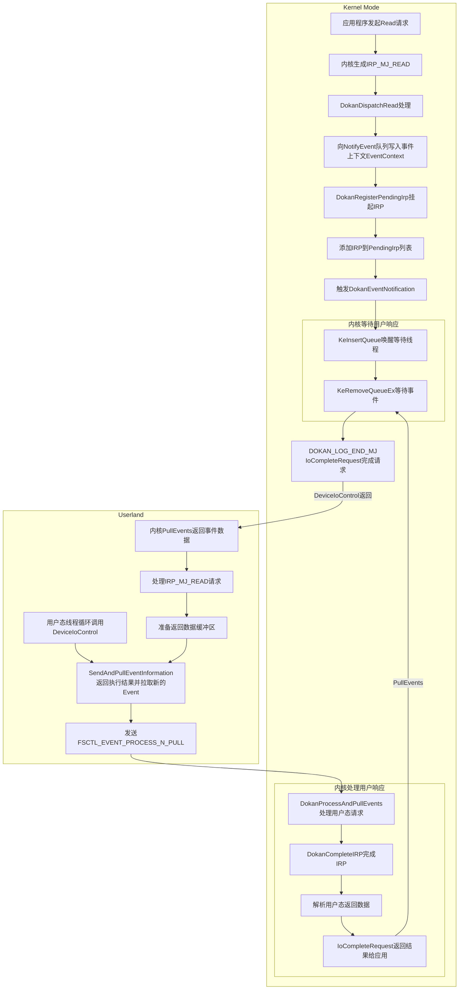
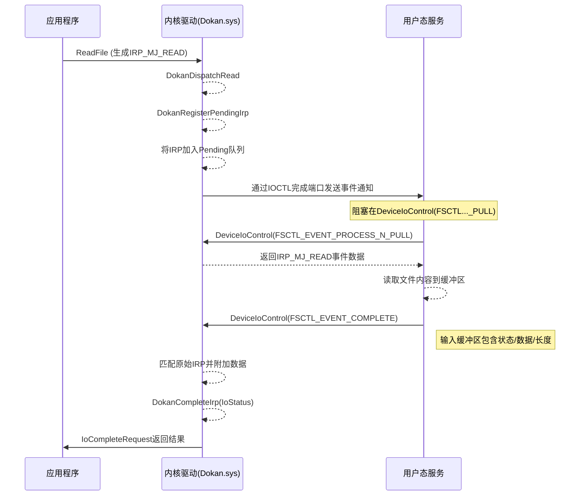

事件处理完整流程示例

```c
/*
IRP_MJ_READ:
DokanDispatchRead
  DokanRegisterPendingIrp
    # add IRP_MJ_READ to PendingIrp list
    RegisterPendingIrpMain(PendingIrp)
    # put MJ_READ event into NotifyEvent
    DokanEventNotification(NotifyEvent, EventContext)

FSCTL_EVENT_PROCESS_N_PULL:
  DokanProcessAndPullEvents
    # Pull the previously registered event
    PullEvents(NotifyEvent)

FSCTL_EVENT_PROCESS_N_PULL:
  DokanProcessAndPullEvents
    # Complete the IRP process by userland
    DokanCompleteIrp
    # Pull the new registered event
    PullEvents(NotifyEvent)
*/
```

以下是修正后的Dokan事件处理流程及数据交互图，明确区分用户态和内核态的边界及通信方式：



------

### 修正后的关键交互步骤说明

#### 阶段1：内核态接收请求

1. **IRP生成**  
   应用程序调用ReadFile时，Windows内核生成`IRP_MJ_READ`请求。
2. **Dokan拦截处理**  
   内核驱动`Dokan.sys`的`DokanDispatchRead`例程捕获该IRP。
3. **挂起IRP**  
   调用`DokanRegisterPendingIrp`将IRP标记为`Pending`状态，防止内核超时。
4. **事件入队**  
   将事件上下文（含IRP编号、文件句柄、偏移量等）写入`NotifyEvent`环形缓冲区。
5. **异步通知**  
   通过`DeviceIoControl`的完成端口机制唤醒用户态服务（非阻塞等待）。

#### 阶段2：用户态处理事件

6. **事件拉取**  
   用户态调用`DeviceIoControl(FSCTL_EVENT_PROCESS_N_PULL)`，内核从`NotifyEvent`队列提取事件数据。
7. **业务逻辑处理**  
   用户态解析事件类型（如IRP_MJ_READ），执行实际文件读取操作。
8. **结果封装**  
   将读取的数据或错误码封装到结构体中（如`DOKAN_EVENT_COMPLETE`）。

#### 阶段3：用户态返回结果

9. **结果回传**  
   用户态调用`DeviceIoControl(FSCTL_EVENT_COMPLETE)`，通过输入缓冲区将结果数据发送到内核。
   - **控制码类型**: `FSCTL_EVENT_COMPLETE` (自定义IOCTL)
   - **数据载体**: `Irp->AssociatedIrp.SystemBuffer`
   - **包含字段**: IRP编号、操作状态、数据长度、数据缓冲区指针

#### 阶段4：内核态完成IRP

10. **数据解析**  
    内核驱动从输入缓冲区提取用户态返回的结果数据。
11. **挂起IRP恢复**  
    通过IRP编号找到原始挂起的IRP，附加数据到`Irp->UserBuffer`。
12. **完成请求**  
    调用`DokanCompleteIrp`设置IRP状态（`Irp->IoStatus.Status`），并执行`IoCompleteRequest`通知内核处理结束。

------

### 用户态与内核态通信数据流详图



------

### 关键修正点说明

1. **DokanCompleteIrp的调用位置**  
   - **错误点**：原流程图误将`DokanCompleteIrp`置于用户态。
   - **修正**：`DokanCompleteIrp`是内核内部函数，只能由内核驱动调用。用户态通过`FSCTL_EVENT_COMPLETE`通知内核，由内核触发IRP完成。
2. **IOCTL双向通信机制**  
   - **事件拉取**：`FSCTL_EVENT_PROCESS_N_PULL`用于从内核拉取事件。
   - **结果回传**：`FSCTL_EVENT_COMPLETE`用于向内核提交处理结果。
   - **数据载体**：输入/输出缓冲区通过`DeviceIoControl`的`InBuffer`和`OutBuffer`传递。
3. **IRP生命周期管理**  
   - **Pending状态**：IRP被挂起后，由内核维护其引用，避免被系统回收。
   - **IRP标识符**：用户态返回的数据必须包含原始IRP的唯一ID，确保内核正确匹配。

------

### 用户态与内核态交互API映射表

| 操作类型     | 内核态函数              | 用户态调用                      | 通信方向          |
| ------------ | ----------------------- | ------------------------------- | ----------------- |
| 事件通知     | DokanEventNotification  | DeviceIoControl(FSCTL_PULL)     | 内核→用户（异步） |
| 事件处理完成 | DokanCompleteIrp        | DeviceIoControl(FSCTL_COMPLETE) | 用户→内核（同步） |
| IRP挂起管理  | DokanRegisterPendingIrp | 无                              | 内核内部操作      |

------

此修正后的流程准确反映了Dokan驱动的工作机制，用户态不直接操作内核对象，所有跨态通信均通过安全的IOCTL接口实现，符合Windows驱动开发规范。