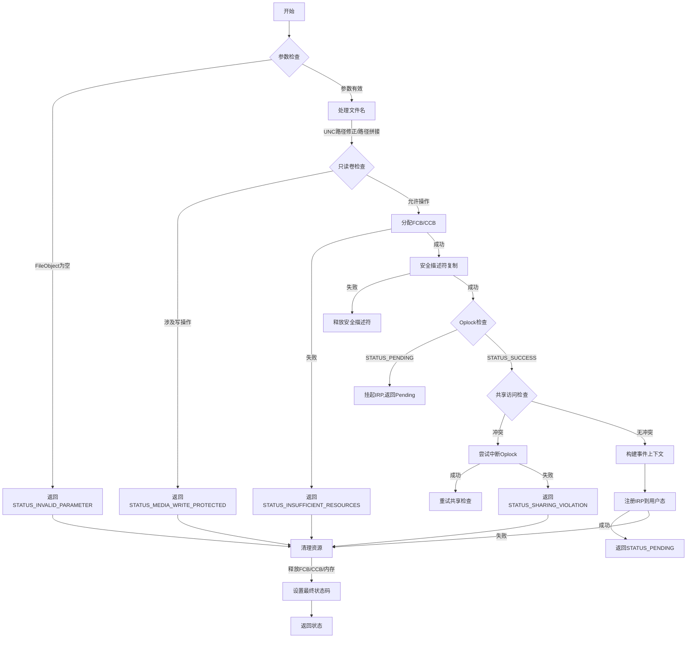
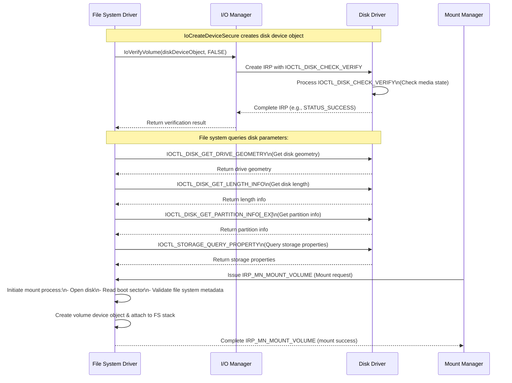

### **代码分析：DokanDispatchCreate**

#### **函数作用**
`DokanDispatchCreate` 是 Dokan 驱动中处理文件/目录创建请求（`IRP_MJ_CREATE`）的核心函数。它负责解析请求、构建上下文、管理文件控制块（FCB）和上下文控制块（CCB），并通过事件机制将操作传递给用户态回调。

---

### **关键步骤解析**

#### **1. 参数初始化与校验**
- **变量声明**：
  - `fileObject`：当前请求的文件对象（`IrpSp->FileObject`）。
  - `fcb`（文件控制块）：管理文件元数据（如文件名、锁、共享状态）。
  - `ccb`（上下文控制块）：跟踪当前操作的上下文（如用户态事件、安全上下文）。
- **异常处理**：
  使用 `__try/__finally` 确保资源释放（如内存、锁）。

#### **2. 文件名处理**
- **路径规范化**：
  处理 UNC 路径前缀（如 `\\?\`）和尾部反斜杠，确保路径格式正确。
  ```c
  if (fileObject->FileName.Buffer[0] == L'\\' && ...) {
      fileObject->FileName.Length -= sizeof(WCHAR);
      RtlMoveMemory(...);
  }
  ```
- **相关文件对象（`relatedFileObject`）**：
  若存在父目录（如相对路径），拼接父目录路径与当前文件名，生成绝对路径。
  ```c
  if (relatedFileObject) {
      RtlCopyMemory(fileName, relatedFileName->Buffer, ...);
      fileNameLength += relatedFileName->Length;
  }
  ```

#### **3. 安全与权限检查**
- **安全描述符复制**：
  使用 `SeAssignSecurity` 复制安全描述符，确保用户态回调能处理权限验证。
  ```c
  SeAssignSecurity(NULL, securityDescriptor, &newFileSecurityDescriptor, ...);
  ```
- **只读卷检查**：
  若卷为只读且请求涉及写操作（如 `FILE_SUPERSEDE`），返回 `STATUS_MEDIA_WRITE_PROTECTED`。
  ```c
  if (IS_DEVICE_READ_ONLY(...) && (disposition == FILE_SUPERSEDE || ...)) {
      status = STATUS_MEDIA_WRITE_PROTECTED;
  }
  ```

#### **4. 文件控制块（FCB）与上下文控制块（CCB）管理**
- **FCB 分配**：
  通过 `DokanGetFCB` 获取或创建 FCB，管理文件状态（如打开计数、锁）。
  ```c
  fcb = DokanGetFCB(RequestContext, fileName, fileNameLength);
  ```
- **CCB 分配**：
  为当前操作分配 CCB，关联到 `fileObject->FsContext2`。
  ```c
  ccb = DokanAllocateCCB(RequestContext, fcb);
  fileObject->FsContext2 = ccb;
  ```

#### **5. 事件上下文构建**
- **内存分配**：
  计算 `eventContext` 所需内存（包括安全描述符、路径名等），并分配缓冲区。
  ```c
  eventContext = AllocateEventContext(RequestContext, eventLength, ccb);
  ```
- **数据填充**：
  复制文件名、安全描述符、访问状态等到 `eventContext`，准备发送到用户态。
  ```c
  RtlCopyMemory(eventContext->Operation.Create.FileName, fileName, ...);
  ```

#### **6. Oplock 与共享访问**
- **Oplock 检查**：
  使用 `FsRtlCheckOplock` 处理 Oplock 中断（如共享冲突时等待锁释放）。
  ```c
  status = FsRtlCheckOplock(..., DokanRetryCreateAfterOplockBreak);
  ```
- **共享访问管理**：
  通过 `IoSetShareAccess` 和 `IoUpdateShareAccess` 更新共享状态，避免并发冲突。
  ```c
  IoSetShareAccess(desiredAccess, shareAccess, fileObject, &fcb->ShareAccess);
  ```

#### **7. 异步处理与用户态回调**
- **挂起 IRP**：
  将 IRP 注册到挂起队列，等待用户态处理完成。
  ```c
  status = DokanRegisterPendingIrp(RequestContext, eventContext);
  ```
- **错误回滚**：
  若操作失败（如资源不足、权限拒绝），释放 FCB/CCB 并重置 `fileObject` 上下文。
  ```c
  if (!NT_SUCCESS(status)) {
      DokanFreeCCB(ccb);
      DokanFreeFCB(fcb);
      fileObject->FsContext = NULL;
  }
  ```

---

### **潜在问题与改进建议**

#### **1. 内存管理**
- **风险点**：
  多路径内存分配（如 `fileName`、`eventContext`）可能导致泄漏，尤其在异常分支。
- **改进**：
  使用 RAII 风格封装资源（如 `ExAllocatePool`/`ExFreePool` 配对），或引入引用计数。

#### **2. 路径处理**
- **风险点**：
  路径拼接时未检查缓冲区溢出（如 `fileName` 分配 `fileNameLength + sizeof(WCHAR)`，但实际拷贝未验证长度）。
- **改进**：
  使用安全函数（如 `RtlStringCbCopyNW`）替代 `RtlCopyMemory`，并添加长度校验。

#### **3. 并发与锁**
- **风险点**：
  `DokanFCBLockRW(fcb)` 可能在嵌套调用时导致死锁（如重入同一 FCB）。
- **改进**：
  使用递归锁或明确锁的层次顺序，避免交叉锁定。

#### **4. 安全描述符**
- **风险点**：
  `SeAssignSecurity` 失败时未处理 `newFileSecurityDescriptor` 可能遗留指针。
- **改进**：
  初始化 `newFileSecurityDescriptor` 为 `NULL`，并在 `__finally` 中统一释放。

#### **5. 异步回调**
- **风险点**：
  `DokanRegisterPendingIrp` 后若用户态未及时响应，可能导致 IRP 超时或资源泄漏。
- **改进**：
  添加超时机制，或在内核态维护 IRP 生命周期跟踪。

---

### **总结**
`DokanDispatchCreate` 是 Dokan 驱动中处理文件创建的核心函数，涉及路径处理、资源管理、安全权限和异步回调。其关键挑战在于：
1. **复杂的状态管理**：FCB/CCB 的分配与释放需严格匹配。
2. **并发控制**：Oplock 和共享访问需正确处理竞争条件。
3. **用户态交互**：通过事件上下文传递操作，需保证数据完整性和及时性。

通过优化内存管理、增强路径安全性、细化锁策略，可进一步提升该函数的健壮性和性能。


以下是 **DokanDispatchCreate** 函数的流程图，描述了处理 `IRP_MJ_CREATE` 请求的核心逻辑：



---

### **流程图关键节点说明**

1. **参数检查**
   - 检查 `FileObject` 是否为空，若为空直接返回错误。

2. **文件名处理**
   - 修正 UNC 路径（如 `\\?\` 前缀）和路径拼接（相对路径转绝对路径）。

3. **只读卷检查**
   - 若卷为只读且请求涉及写操作（如 `FILE_SUPERSEDE`），返回写保护错误。

4. **分配 FCB/CCB**
   - 分配文件控制块（FCB）和上下文控制块（CCB），失败则返回资源不足。

5. **安全描述符复制**
   - 复制安全描述符用于用户态权限验证，失败需释放资源。

6. **Oplock 检查**
   - 检查文件 Oplock 状态，若需中断则挂起 IRP（返回 `STATUS_PENDING`）。

7. **共享访问检查**
   - 验证文件共享权限，若冲突尝试中断 Oplock 并重试，否则返回共享冲突。

8. **构建事件上下文**
   - 准备发送到用户态的事件数据（路径、安全描述符等）。

9. **注册 IRP**
   - 将 IRP 挂起并等待用户态回调处理结果，失败则清理资源。

10. **清理资源**
    - 释放 FCB/CCB、内存、安全描述符，并重置 `FileObject` 上下文。

---

### **核心路径**
```text
参数有效 → 路径处理 → 分配FCB/CCB → 安全检查 → Oplock检查通过 → 共享检查通过 → 构建事件上下文 → 注册IRP → 返回Pending
```

### **错误路径示例**
```text
FileObject为空 → 返回错误
只读卷写操作 → 返回写保护
FCB分配失败 → 返回资源不足
共享冲突且无法中断 → 返回共享冲突
```

---

### **备注**
- **Oplock 中断**：若其他进程持有 Oplock，当前请求可能被挂起（`STATUS_PENDING`），等待锁释放后重试。
- **用户态交互**：通过 `AllocateEventContext` 和 `DokanRegisterPendingIrp` 将操作传递给用户态文件系统实现。
- **资源管理**：所有资源（内存、FCB/CCB）在 `__finally` 块中统一释放，确保无泄漏。


### DeviceIoControl

#### [IRP_MJ_FILE_SYSTEM_CONTROL][https://learn.microsoft.com/en-us/previous-versions/windows/drivers/ifs/irp-mj-file-system-control]

```c
#define FSCTL_EVENT_PROCESS_N_PULL                                                     \
  CTL_CODE(FILE_DEVICE_FILE_SYSTEM, 0x812, METHOD_BUFFERED, FILE_ANY_ACCESS)
```

IOCTL 控制代码，表示要执行的操作类型。`FSCTL_EVENT_PROCESS_N_PULL` 是 Dokan 定义的控制代码，用于从驱动程序拉取文件系统事件。

使用`FILE_DEVICE_FILE_SYSTEM`定义IOCTL 控制代码，会触发`IRP_MJ_FILE_SYSTEM_CONTROL`事件

| Code                   | Description                                                  |
| :--------------------- | :----------------------------------------------------------- |
| IRP_MN_KERNEL_CALL     | This request is the same as IRP_MN_USER_FS_REQUEST (described following), except that the source of the request is a trusted kernel component. |
| IRP_MN_MOUNT_VOLUME    | Indicates a volume mount request. If a file system driver receives this IRP for a volume whose format doesn't match that of the file system, the file system driver should return STATUS_UNRECOGNIZED_VOLUME. |
| IRP_MN_USER_FS_REQUEST | Indicates an FSCTL request, possibly on behalf of a user-mode application that has called the Microsoft Win32 DeviceIoControl function or on behalf of a kernel-mode component that has called [**ZwDeviceIoControlFile**](https://learn.microsoft.com/en-us/windows-hardware/drivers/ddi/ntifs/nf-ntifs-zwdeviceiocontrolfile) or [**IoBuildDeviceIoControlRequest**](https://learn.microsoft.com/en-us/windows-hardware/drivers/ddi/wdm/nf-wdm-iobuilddeviceiocontrolrequest). For detailed information about FSCTL requests, see "Device Input and Output Control Codes" in the Windows SDK documentation. |
| IRP_MN_VERIFY_VOLUME   | Indicates a volume verification request. For removable media, the file system must verify the volume when it detects that the media has been removed and returned to ensure that it's still the same known volume. If the volume has changed, the file system should invalidate all outstanding handles. It should also return an error if the file system on this new media has changed. This request is most often used for floppy drives. |


### DokanGlobal

```C
typedef enum _FSD_IDENTIFIER_TYPE {
  DGL = ':DGL',       // Dokan Global
  DCB = ':DDC',       // Disk Control Block
  VCB = ':VCB',       // Volume Control Block
  FCB = ':FCB',       // File Control Block
  CCB = ':CCB',       // Context Control Block
  FREED_FCB = ':FFC', // FCB that has been freed
} FSD_IDENTIFIER_TYPE;
```

```C
  // Following variables are set depending the type of DeviceObject Type.
  // Note: For Vcb, Dcb will also be set to Vcb->Dcb.
  PDOKAN_GLOBAL DokanGlobal;
  PDokanDCB Dcb;
  PDokanVCB Vcb;
```

#### DokanGlobal

-->DokanCreateGlobalDiskDevice驱动创建的全局设备对象

```c
    IoCreateDeviceSecure(DriverObject,         // DriverObject
    sizeof(DOKAN_GLOBAL), // DeviceExtensionSize
    &deviceName,          // DeviceName
    FILE_DEVICE_UNKNOWN,  // DeviceType
    0,                    // DeviceCharacteristics
    FALSE,                // Not Exclusive
    &sddl,                // Default SDDL String
    NULL,                 // Device Class GUID
    &deviceObject);       // DeviceObject
```

#### Dcb

-->DokanCreateDiskDevice创建磁盘设备对象

```c
	IoCreateDeviceSecure(DriverObject,          // DriverObject
    sizeof(DokanDCB),      // DeviceExtensionSize
    &diskDeviceName,       // DeviceName
    FILE_DEVICE_DISK,      // DeviceType
    DeviceCharacteristics, // DeviceCharacteristics
    FALSE,                 // Not Exclusive
    &sddl,                 // Default SDDL String
    NULL,                  // Device Class GUID
    &diskDeviceObject);    // DeviceObject
```

#### Vcb

-->DokanMountVolume卷挂载请求

```c
case IRP_MN_MOUNT_VOLUME:
    return DokanMountVolume(RequestContext);
```


### [**IoVerifyVolume**][https://learn.microsoft.com/en-us/windows-hardware/drivers/ddi/ntifs/nf-ntifs-ioverifyvolume]

**IoVerifyVolume** sends a volume verify request to the specified removable-media device identified by the device object.

- **检查挂载状态**：`IoVerifyVolume` 首先检查卷是否已挂载。如果卷已挂载，函数直接返回成功。
- **触发挂载操作**：如果卷未挂载，`IoVerifyVolume`会触发挂载操作。这可能涉及发送`IRP_MJ_FILE_SYSTEM_CONTROL`类型的 IRP，次要功能代码为`IRP_MN_MOUNT_VOLUME`，以挂载卷。

`IoVerifyVolume`会重新进入调用`DokanMountVolume`，后者会调用`DokanCreateMountPoint`，`DokanCreateMountPoint`会重新进入发出`IOCTL_MOUNTDEV_LINK_CREATED`命令，并更新挂载项。


#### Mount Sequence Flow Details

1. **Device Creation:**
   - **IoCreateDeviceSecure** creates the disk device object with the provided SDDL and device extension (e.g., your DokanDCB).
   - At this point, the disk is registered with the I/O system but remains unmounted.
2. **Volume Verification:**
   - **IoVerifyVolume(diskDeviceObject, FALSE)** is invoked.
   - This causes the I/O Manager to build an IRP with the major function **IRP_MJ_DEVICE_CONTROL** and the control code **IOCTL_DISK_CHECK_VERIFY**.
   - The **Disk Driver** processes this IOCTL to verify the media state (ensuring the disk’s media is present and unchanged).
   - After processing, the driver completes the IRP (commonly with **STATUS_SUCCESS** if everything is normal).
3. **Additional Disk Queries Prior to Mounting:**
   - Once the disk media is verified, the file system (or the Mount Manager) will typically query further details about the disk before mounting. This may include:
     - **IOCTL_DISK_GET_DRIVE_GEOMETRY**: To obtain the disk geometry (sectors, tracks, cylinders), which is essential for understanding physical disk layout.
     - **IOCTL_DISK_GET_LENGTH_INFO**: To determine the total size (length) of the disk.
     - **IOCTL_DISK_GET_PARTITION_INFO / IOCTL_DISK_GET_PARTITION_INFO_EX**: For partitioned disks, to retrieve partition layout and related information.
     - **IOCTL_STORAGE_QUERY_PROPERTY**: To query storage properties (such as bus type, media type, and other device-specific characteristics).
4. **Mount Request:**
   - After the above queries, the Mount Manager (or the file system driver itself) issues an IRP with the minor function **IRP_MN_MOUNT_VOLUME**.
   - The file system driver then begins the mounting process. This typically involves:
     - Opening the disk for reading.
     - Reading the boot sector or volume header to detect the file system type.
     - Validating file system metadata and consistency.
     - Creating a volume device object and attaching it to the device stack.
     - Completing the mount IRP to signal that the volume is now accessible.




### VPB

`VPB` 是 Windows 文件系统驱动中用于 **管理卷设备与文件系统关系** 的核心数据结构。它通过绑定物理卷设备与文件系统设备，确保文件系统能够正确访问和管理卷上的数据。在挂载、卸载和路径解析等操作中，`VPB` 都起着关键作用 。

  **1. VPB 的作用**

- **绑定卷设备与文件系统**：`VPB` 用于将 **物理卷设备**（如 `\Device\HarddiskVolume1`）与 **文件系统设备**（如 NTFS 或 FAT32 文件系统）绑定在一起。它确保文件系统能够正确管理和访问卷设备上的数据。
- **挂载点管理**：`VPB` 是挂载点（如盘符 `C:`）与卷设备之间的桥梁。当用户访问挂载点时，Windows 对象管理器会通过 `VPB` 找到对应的文件系统设备。 
-  **卷挂载状态**：`VPB` 包含卷的挂载状态信息，如是否已挂载（`VPB_MOUNTED`）、是否被锁定（`VPB_LOCKED`）等。


### **Mount Manager**

1. **使用Mount Manager**

   `MountPointManager` 设备是 **Windows 操作系统内核** 的一部分，由挂载管理器创建和管理。它的主要功能是管理卷设备的挂载点、盘符分配和符号链接，确保文件系统能够正确访问卷设备。

   ```mermaid
   graph TD
       A[IoVerifyVolume] --> B[调用DokanMountVolume]
       B --> C[调用DokanCreateMountPoint]
       C --> D[发送IOCTL_MOUNTDEV_LINK_CREATED命令]
       D --> E[更新挂载项属性]
       E --> F{是驱动器号挂载?}
       F -->|是| G[复制\\DosDevices\\X:格式的驱动器号]
       F -->|否| H[目录挂载点不处理驱动器号]
       G --> I[返回挂载信息]
       H --> I
       I --> J((结束))
       
   
   style A fill:#c0ffc0,stroke:#333
   style B fill:#f0f0f0,stroke:#333
   style C fill:#f0f0f0,stroke:#333
   style D fill:#f0f0f0,stroke:#333
   style E fill:#f0f0f0,stroke:#333
   style F fill:#ffeb3b,stroke:#333
   style G fill:#f0f0f0,stroke:#333
   style H fill:#f0f0f0,stroke:#333
   style I fill:#ffcccc,stroke:#333
   ```

   

   #### **MountPointManager 设备的使用场景**

   - **卷设备挂载**：当存储类驱动程序检测到新的卷设备时，会通过 `MountPointManager` 设备通知挂载管理器，触发挂载操作。
   - **盘符分配**：挂载管理器通过 `MountPointManager` 设备为卷设备分配盘符，并将其与文件系统绑定。
   - **符号链接管理**：挂载管理器通过 `MountPointManager`设备管理卷设备的符号链接，确保文件系统能够正确访问卷设备。

   **Dokan通知挂载盘符**

   ```c
   DokanSendIoContlToMountManager(
         IOCTL_MOUNTMGR_VOLUME_ARRIVAL_NOTIFICATION, targetName, length, NULL, 0);
   ```

   使用 `IOCTL_MOUNTMGR_VOLUME_ARRIVAL_NOTIFICATION` 通知挂载管理器（Mount Manager）时，**不需要给定盘符**。该 IOCTL 的主要作用是通知挂载管理器某个卷设备已经到达或可用，挂载管理器会根据其内部逻辑**自动分配盘符或使用已有的挂载点**。

2. **不使用Mount Manager**

   手动创建符号链接，指定盘符

   ```c
   DokanCreateMountPoint(dcb);
   ```

   ```c
   status = IoCreateSymbolicLink(Dcb->MountPoint, Dcb->DiskDeviceName);
   ```


挂载成网络盘，需注册UncProvider   

```
 RunAsSystem(DokanRegisterUncProvider, dcb);
```


### dokan.dll挂载到文件夹，设置重解析点

挂载到文件夹，由dokan.dll通知挂载`CreateMountPoint`

```c
BOOL DokanMount(PDOKAN_INSTANCE DokanInstance, PDOKAN_OPTIONS DokanOptions)
{
    UNREFERENCED_PARAMETER(DokanOptions);
    if (DokanInstance->MountPoint != NULL)
    {
        if (!IsMountPointDriveLetter(DokanInstance->MountPoint))
        {
            if (DokanOptions->Options & DOKAN_OPTION_MOUNT_MANAGER)
            {
                return TRUE; // Kernel has already created the reparse point.
            }
            // Should it not also be moved to kernel ?
            return CreateMountPoint(DokanInstance->MountPoint,
                DokanInstance->DeviceName);
        }
        else
        {
            // Notify applications / explorer
            DokanBroadcastLink(DokanInstance, FALSE);
        }
    }
    return TRUE;
}
```

[FSCTL_SET_REPARSE_POINT control code][https://learn.microsoft.com/en-us/windows-hardware/drivers/ifs/fsctl-set-reparse-point]

[REPARSE_DATA_BUFFER structure][https://learn.microsoft.com/en-us/windows-hardware/drivers/ddi/ntifs/ns-ntifs-_reparse_data_buffer]

### [Mount Manager requests ][https://learn.microsoft.com/en-us/windows-hardware/drivers/storage/supporting-mount-manager-requests-in-a-storage-class-driver]


[https://learn.microsoft.com/en-us/previous-versions/windows/drivers/ifs/irp-mj-file-system-control]: 
